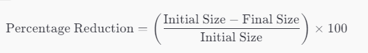

# MP9 - UF2 Act3 - Modern Image Formats (WEBP and AVIF)

## Objective:

In this task, we will analyse newer image formats and their impact on the performance of a web page. We will also use the DeveloperTools to analyze the loading of the images.

### Instructions:

If you need, you can use code from the previous activity (Act2 - Image Formats) as you will need to show your images again in a new website. Copy the necessary things you need from it. Here you'll just find the instructions and same original images as before.

#### Royalty-free images Websites

- [Unsplash](https://unsplash.com/)
- [Pexels](https://www.pexels.com/)
- [Pixabay](https://pixabay.com/)
- [Burst](https://burst.shopify.com/)
- [StockSnap](https://stocksnap.io/)
- [Reshot](https://www.reshot.com/)
- [Gratisography](https://gratisography.com/)
- [Picjumbo](https://picjumbo.com/)
- [Kaboompics](https://kaboompics.com/)
- [Rawpixel](https://www.rawpixel.com/)
- [Foodiesfeed](https://www.foodiesfeed.com/)
- [Moose](https://photos.icons8.com/)
- [Life of Pix](https://www.lifeofpix.com/)
- [ISO Republic](https://isorepublic.com/)
- [New Old Stock](https://nos.twnsnd.co/)

#### Online tools to convert images

- [Online Image Converter](https://image.online-convert.com/)
- [Squoosh](https://squoosh.app/)
- [Convertio](https://convertio.co/es)
- [CloudConvert](https://cloudconvert.com)
- [Image Online](https://image.online-convert.com)

#### Tools you shared in the previous activity

| Tool Name               | URL                                                                                                                                    | Online Tool? | Short Explanation                                                                                                             |
| ----------------------- | -------------------------------------------------------------------------------------------------------------------------------------- | ------------ | ----------------------------------------------------------------------------------------------------------------------------- |
| IrfanView               | [https://www.irfanview.com](https://www.irfanview.com)                                                                                 | NO           | Fast image viewer with basic editing functions, ideal for quick edits.                                                        |
| Pixlr                   | [https://pixlr.com/es/](https://pixlr.com/es/)                                                                                         | YES          | Online image editor offering various export options (PNG, JPEG, GIF), comparison of quality and size, and more tools.         |
| PaintNet                | [https://www.getpaint.net/](https://www.getpaint.net/)                                                                                 | NO           | Free image editing program for Windows, with basic editing functions and support for multiple export formats.                 |
| Adobe Photoshop         | [https://www.adobe.com/es/products/photoshop.html](https://www.adobe.com/es/products/photoshop.html)                                   | NO           | Professional image processing program offering wide format support and compression adjustment for JPEG.                       |
| Photopea                | [https://www.photopea.com](https://www.photopea.com)                                                                                   | YES          | Online image editor similar to Photoshop, accessible through web browsers, with layer-based editing and format support.       |
| XnConvert               | [https://www.xnview.com/en/xnconvert/](https://www.xnview.com/en/xnconvert/)                                                           | NO           | Cross-platform batch image converter with editing automation features for rotating, converting, and compressing images.       |
| Darktable               | [https://www.darktable.org/](https://www.darktable.org/)                                                                               | NO           | Free software for photography aimed at facilitating RAW image processing and workflow.                                        |
| Powertoys Image Resizer | [https://learn.microsoft.com/en-us/windows/powertoys/image-resizer](https://learn.microsoft.com/en-us/windows/powertoys/image-resizer) | NO           | Windows shell extension for bulk image resizing, allowing resizing through right-click context menu.                          |
| Affinity Photo          | [https://affinity.serif.com/es/photo/](https://affinity.serif.com/es/photo/)                                                           | NO           | Professional image editing application offering features similar to Photoshop, popular among designers and photographers.     |
| Optimizilla             | [https://imagecompressor.com/](https://imagecompressor.com/)                                                                           | YES          | Online tool for optimizing and compressing JPEG, GIF, and PNG images with smart algorithms for minimum file size.             |
| Icecream Photo Editor   | [https://icecreamapps.com/es/Photo-Editor/](https://icecreamapps.com/es/Photo-Editor/)                                                 | NO           | Free photo editor and manager for Windows offering various editing features such as text/image adding, cropping, and filters. |
| Canva                   | [https://www.canva.com/](https://www.canva.com/)                                                                                       | YES          | Web-based graphic design platform with easy-to-use tools for creating and exporting images for various purposes.              |

### Task 1: WebP

- The same way you did in the previous task, we're going to export the images provided in the `images` folder to WebP format. You can use the same online tool or any other tool you prefer.
- DO NOT CHANGE THE DIMENSIONS OF THE IMAGES! They should be the same as the original ones. COMPRESS THEM AS MUCH AS POSSIBLE WITHOUT LOSING QUALITY!
- This time you need to find a **compression rate** that makes it **optimal for the image to be displayed on A RATHER BIG SCREEN**. Let's say we have a 4k screen (3840x2160) and we want to display the image full screen.
- Finally, create a table (you can check Tailwind layouts if you want https://tailwindcss.com/docs/table-layout) at the end of the page with the information of the template given.
- **Use kB as unit** for the size of the images to make it easier to compare them.
- The **saving** can be calculated as follows: `saving = (original size - new size) / original size * 100`. See the image below:

    

- You can try to make the calculation **using JavaScript** if you want, but it's not mandatory.

<!-- \[ \text{Percentage Reduction} = \left( \frac{\text{Initial Size} - \text{Final Size}}{\text{Initial Size}} \right) \times 100 \] -->

| Image Name | Original size | JPG (Saving %) | WebP (Saving %) |
| ---------- | ------------- | -------------- | --------------- |
| gos.jpg    | 500kB         | 100kB (80%)    | ...             |

- What happens with GIF file? Can we use WebP to replace it?

### Task2: AVIF

AVIF is an open-source image format developed by the Alliance for Open Media (AOMedia) in February 2019. It serves as both a still and animated image format and is derived from the AV1 video format. The primary objective was to create a state-of-the-art, royalty-free video coding format.

**Key Benefits:**

1. **Efficient Compression:** AVIF supports highly efficient lossy and lossless compression, resulting in high-quality images after compression.
2. **Superior Compression:** Compared to popular web formats like JPEG, WebP, and JPEG 2000, AVIF often achieves significantly better compression. Images can be up to ten times smaller than JPEGs while maintaining similar visual quality.
3. **File Size Savings:** In some tests, AVIF has demonstrated a 50% reduction in file size compared to JPEG, all while maintaining comparable perceptual quality.
4. **Considerations:** While AVIF generally excels, there may be cases where WebP lossless compression outperforms AVIF lossless, so manual evaluation is recommended.

In summary, AVIF offers advanced compression capabilities, making it a compelling choice for web images with the potential for significant file size reduction without sacrificing quality.

#### What to do:

Have a look at the following article which has many examples of when and how to use AVIF:
https://jakearchibald.com/2020/avif-has-landed/

- Create a new page called `avif.html`.
- Find 3 examples of different images (check **Royalty-free images Websites** section. It's better if they've different patterns (repetition of elements, colors...).
- As you did before, find the optimal compression rate for the images to be displayed on a rather big screen and **use each JPG, WebP, AVIF format**.
- Create also a table like the one in the previous task to show the results.
- Explain what you could observe, the differences, if AVIF is a good replacement for WebP, etc.

- **Publish the website in Github Pages, Netlify or Vercel and share the link in the Moodle task.**
